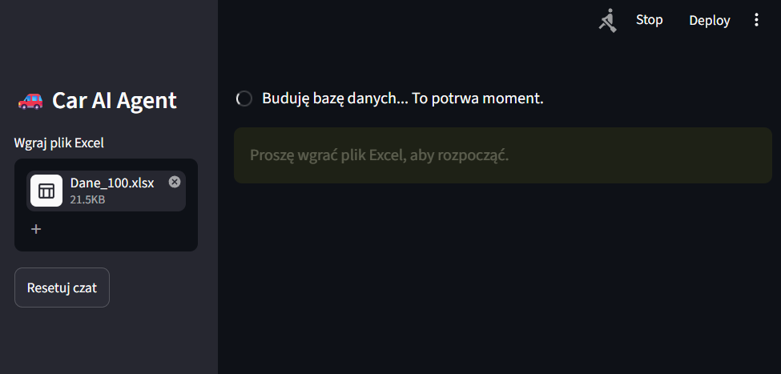

# SI_2026  
## Autor: Zofia Głowacka_21234
### Laboratoria:
- [Laboratorium_1](Lab1_21234.ipynb)
- [Laboratorium_2](Lab2_21234.ipynb)
- [Laboratorium_3](Lab3_21234.ipynb)
- [Laboratorium_4_cz1](Lab4_cz1_21234.ipynb)
- [Laboratorium_4_cz2](Lab4_cz2_21234.ipynb)

### Projekt (Car AI Assistant):
[Projekt_21234](Projekt_21234)  
- Projekt należy uruchomić z pliku *app.py*  
- Niezbędne foldery do działania programu to: *data* oraz *chroma_db*

#### Opis i działanie projektu:
Car AI Assistant to prosty system RAG (Retrieval-Augmented Generation) oparty na lokalnym modelu językowym uruchamianym przez Ollama. Aplikacja pozwala zadawać pytania dotyczące bazy samochodów zapisanej w pliku Excel przy użyciu naturalnego języka.  

#### *Funkcjonalności*  
- Import danych z pliku Excel (.xlsx)
- Lokalny model AI uruchamiany przez Ollama (Llama 3)
- Wyszukiwanie semantyczne z wykorzystaniem ChromaDB i embeddings
- Analiza danych za pomocą Pandas
- Streaming odpowiedzi w czasie rzeczywistym
- Odpowiadanie na pytania (proste i złożone) dotyczące samochodów

#### *Działanie*  
1. Użytkownik wgrywa plik Excel z danymi o samochodach.
2. Dane są przetwarzane i zapisywane w bazie wektorowej ChromaDB.  

   

